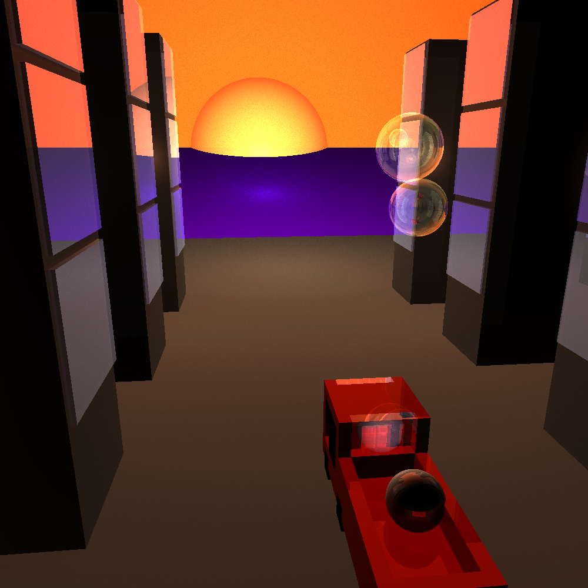
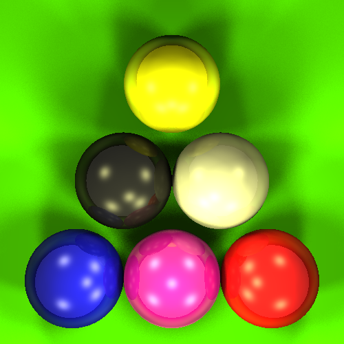

# High-Performance Python Ray Tracer

A professional, optimized ray tracing engine written in Python. This project demonstrates advanced vectorized computation, geometric acceleration, and high configurability:

- Optimized code using numpy for maximum speed and parallelism
- Supports interactive editing of 3D scenes described in plain text
- Efficiently renders scenes with 100+ objects in seconds
- Robust recursive tracing (up to 10 layers deep for reflection and transparency)

---

## 🖼️ Demo Renders

<table>
<tr>
<td align="center"><br>City at Sunset</td>
<td align="center"><br>Colorful Pool Balls</td>
</tr>
</table>

---

## Features
- Geometry: Spheres, cubes, infinite planes, and more
- Materials: Diffuse & specular colors, reflectivity, transparency, Phong highlights
- Lighting: Multiple colored lights, soft shadows, sun/sky simulation
- Reflections & Transparency: Recursive ray-tracing with realistic mirrors and glass
- Numpy Vectorization: Blazing-fast computation using fully parallelized math
- Scene Files: Human-readable text scenes for easy editing (see `scenes/`)
- BSP Acceleration: Smart space partitioning for ultra-fast intersection tests

---

## 🛠️ How It Works

- **Camera** shoots rays through every pixel into the scene
- For each ray:
  - Find what surface it hits first (spheres 🟡, cubes 🟪, planes 🟫)
  - Calculate intersection point & normal
  - Evaluate material: base color, shininess, reflectivity, transparency
  - Compute lighting: 
    - Diffuse (matte color)
    - Specular (shiny highlight)
    - Shadows and soft shadow blending
    - Reflections (recursively bounce rays!)
    - Transparency (trace light through surface)
- **Numpy** powers all math: intersections, color blending, recursion — almost every function runs on whole image arrays at once 🚀
- **BSP (Binary Space Partitioning)**: Accelerates collision by ignoring objects not in the ray's path.

---

## 📦 Supported Geometry & Materials

### Surfaces
- 🟡 **Spheres**: Defined by center & radius
- 🟪 **Cubes**: Axis-aligned, center & size (no rotation)
- 🟫 **Infinite Planes**: By normal and offset
- 🌌 **Background**: Customizable scene fill color

### Materials
- 🎨 **Diffuse Color**: Surface base color
- ✨ **Specular Color**: Shininess (mirror highlight)
- 🎯 **Phong Power**: Control highlight sharpness
- 🪞 **Reflection**: Mirror-like reflection color
- 🪟 **Transparency**: 0=opaque, 1=fully transparent


---

## 🐍 Code Structure (Key Files)

- `ray_tracer.py`: Entry point, high-level pipeline
- `ray_functions.py`: Ray generation, reflections, intersections; all numpy-accelerated
- `BSPNode.py`: BSP tree for geometric acceleration
- `Material.py`, `Light.py`: Material & lighting models
- `Camera.py`, `SceneSettings.py`: Scene configuration
- `surfaces/`: Sphere, Cube, Plane, and abstract base classes
- `Parser.py`: Loads text scene files and objects
- `util.py`: Math helpers, color/image utilities
- `scenes/`: Example customizable scene files
- `output/`: Rendered PNG results

---

## 🚦 How to Run

```bash
python ray_tracer.py scenes/original.txt output/original.png --width 512 --height 512
```
- Tweak any `.txt` file in `scenes/` and rerun for new images!

---

## 📝 Scene Files: Easy Customization
- Compose your 3D world with plain text: add spheres, cubes, lights and set all colors/materials!
- Example (`scenes/original.txt`) — add new lines to customize:
  - `sph x y z radius material` (add spheres)
  - `box x y z size material` (cubes/boxes)
  - `pln nx ny nz offset material` (planes)
  - `lgt x y z r g b spec shadow width` (lights)
  - `mtl r g b ...` (define new materials)

---

## 🚀 Numpy & Performance
- **All core computations are vectorized**:
   - Rays are processed in giant numpy arrays (no loops)
   - Intersection, color blending, and shadowing all run in parallel for max speed
- **BSP trees**: Scene subdivision skips irrelevant geometry for each ray
- **Recursion**: Reflection/transparency depth is configurable for performance


